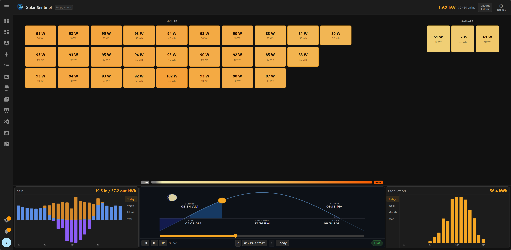
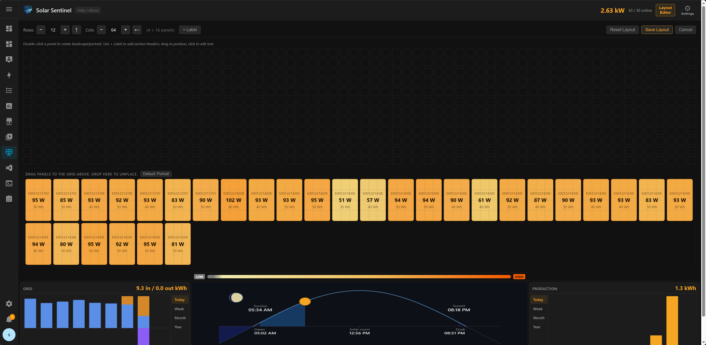
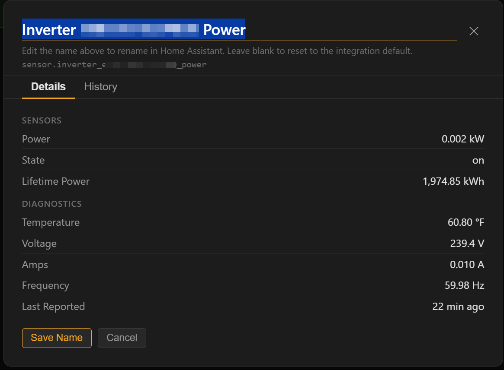
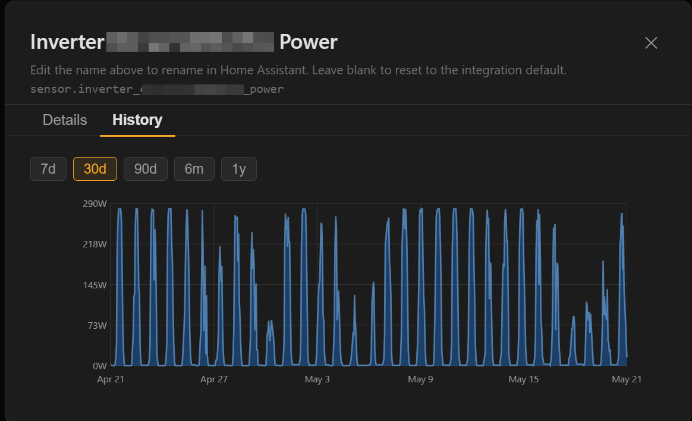
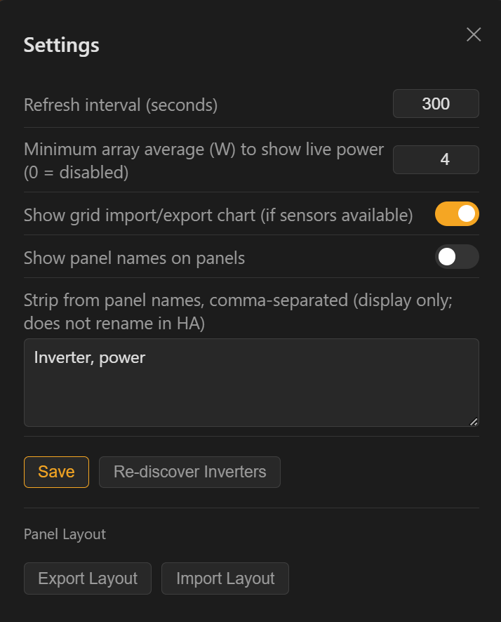

# Solar Sentinel - Home Assistant App / Add-on

Know exactly which panels are pulling their weight and which are not. Solar Sentinel connects to your existing HA Energy Dashboard and displays every inverter or micro-inverter as a live color-coded card, so you can see your array health at a glance without digging through the HA energy graphs.

Should work with any solar integration already configured in the Energy Dashboard: SunPower, Enphase, Fronius, SolarEdge, and anything else that feeds per-panel or per-inverter data into HA. No extra integration setup required.

[](https://github.com/smcneece/solar-sentinel/releases)
[](LICENSE)

> ⚠️ **Installation type**: Solar Sentinel is primarily a Home Assistant **App** (used to be called Add-on's) requiring a Supervisor-managed installation (HA OS or HA Supervised). **Docker support is implemented but untested.** If you run Home Assistant Container and want to give it a try, see [Docker Installation](#docker-installation-untested----looking-for-testers) below and report back. Home Assistant Core (Python package only) is not supported.

> 📱 **Mobile/tablet**: Solar Sentinel is designed for desktop browsers and looks best on a 1080p or larger monitor. It may be usable on a tablet in landscape mode or a phone in landscape for quick viewing, but it is not optimized for small screens. Please do not open an issue about mobile layout; it is a known limitation, not a bug.

> [](https://github.com/sponsors/smcneece) If Solar Sentinel helps you spot a shaded panel, a failing micro-inverter, or just gives you something satisfying to look at on a sunny day, consider sponsoring! Even a small one-time amount shows appreciation. Check out my [other HA projects](https://github.com/smcneece?tab=repositories) while you're here.
>
> ⭐ **Finding this useful?** Star the repo so other HA users can find it!
> [](https://github.com/smcneece/solar-sentinel/stargazers)

---

## Screenshots

**Main View**



**Layout Editor**



**Panel Details**



**Panel History**



**Settings**



---

## Features

### Panel Grid
- Auto-discovers all inverters and micro-inverters from the HA Energy Dashboard; no manual entity configuration required
- Color-coded per-panel cards relative to the array average: green (90%+), yellow (70-89%), red (below 70%), gray (offline or unavailable)
- Live wattage display on each panel card
- Today's energy (Wh) shown on each card, updated as the time slider moves
- Click any panel card to open the panel detail modal:
  - **Details tab**: live sensor readings for every sensor on that device (power, energy, temperature, voltage, amps, frequency, last-reported timestamp); sensor labels are auto-shortened by stripping the common device name prefix
  - **History tab**: per-panel power history chart with selectable ranges (7d, 30d, 90d, 6m, 1y) using HA long-term statistics
  - **Rename**: edit the panel name directly in the modal; the new name is written back to the HA entity registry (not just a local label), so the name is consistent across all of HA; leave blank to revert to the integration-provided name

### Grid Layout Editor
- Drag-and-drop layout editor to position panel cards to match your physical roof layout
- Fine grid with sub-panel precision: the editor shows a graph paper grid where each panel occupies a 4x3 block of squares, letting you place panels with finer alignment than one panel width; the grid lines disappear when you exit the editor
- Panel rotation: double-click any placed panel to toggle between landscape and portrait orientation (wider or taller footprint)
- Overlap prevention: the editor rejects any drop that would cause panels to overlap
- Configurable grid size: +/- buttons step by one fine grid cell for precise sizing; insert row (↑) and insert column (←) buttons add a row at the top or column at the left and shift all panels and labels to make room, so you can add space between sections without manually repositioning everything
- Section labels: click "+ Label" in the toolbar to drop a text box onto the grid; type to name a section ("Garage", "House Panels", etc.); the label auto-expands to fit the text as you type; drag to reposition; visible in both edit and view modes
- Placed panels render in the defined positions; unplaced panels appear in a tray below the grid
- Layout is saved and persists across restarts
- Export and import layout: download your panel positions, rotations, labels, and custom names as a JSON file; import it on another HA instance to replicate the layout without placing panels manually

### Grid Import/Export Chart
- Bar chart panel to the left of the sun arc showing grid energy import and export; only appears when grid sensors are configured in the HA Energy Dashboard
- Four views: Today (hourly bars), Week, Month, Year; total kWh shown in the header
- Import bars (blue) grow upward; export bars (purple) grow downward from a centered zero line; solar energy that offset import during the same hour is shown stacked in orange
- Can be toggled on or off in Settings; hidden automatically when no grid sensors are present

### Battery Panel
- Appears automatically when a battery source is configured in the HA Energy Dashboard; no manual setup required
- Shows current state of charge (SoC %), charge/discharge direction with live power reading, operating mode, and today's kWh charged in / discharged out
- Chart has four views: Today (SoC % line chart over the full 24-hour day), Week, Month, Year (charged vs. discharged kWh as side-by-side bars; green = charged, orange = discharged)
- If both grid and battery sources are present, tabs at the top of the left panel switch between Grid and Battery views
- If only battery is present (no grid sensors), the Battery panel shows directly without tabs; if neither is present, the left panel is hidden

### Production Chart
- Array-level production bar chart displayed alongside the sun arc
- Four views: Today (hourly bars, updates with each refresh), Week (last 5 Sun-Sat calendar weeks), Month (current month plus previous 11), Year (all available years)
- Total kWh for the selected range shown in the header
- Hover over a bar to see a crosshair and tooltip with the time period and kWh value
- Stale overnight sensor readings are suppressed using the same threshold as the panel grid

### Sun Arc
- Animated sun arc showing dawn, sunrise, solar noon, sunset, and dusk for today
- Night arc extension shows the underground sun path before dawn and after dusk, so the arc wraps the full day
- Optional moon phase icon in the pre-dawn area; uses the HA Moon integration if installed (gracefully absent if not)
- Current sun position indicator tracks the sun in real time or matches the time slider position in history mode

### Time Slider and History
- Scrub through the current day using the time slider; all panel cards update to show power output at that moment
- Today's Wh values update via trapezoidal integration as you move the slider, matching the estimated energy produced up to that point
- Date picker and day navigation arrows to view any historical day
- Switch back to live mode at any time
- When detailed recorder data is available, history is shown at full per-state resolution
- When recorder data has been purged (older than `purge_keep_days`), Solar Sentinel automatically falls back to HA's long-term statistics, which provide hourly average power readings; the time label shows "(hourly)" when this is active
- HA's default recorder retention is 10 days; see [History retention](#history-retention) below to extend it

### Configuration and Display
- Help / About modal: shows app version, HA version, install mode, inverters found, and HA timezone; quick links to documentation, changelog, and issue tracker; Download Debug Info button downloads a JSON snapshot of your Energy Dashboard config and entity states (solar-sentinel-debug.json) for issue reporting
- Settings modal: configurable refresh interval; Re-discover button to force a fresh inverter scan without restarting the add-on; Export and Import Layout buttons for transferring panel layouts between HA instances
- Light and dark theme support; follows HA or system preference automatically
- Docker environment support via environment variables (HA_BASE_URL + HA_TOKEN)
- No Lovelace configuration required

---

## Installation

### Via App Store (Recommended)

**Option A: Shortcut button** (requires [My Home Assistant](https://my.home-assistant.io/) to be configured):

[](https://my.home-assistant.io/redirect/supervisor_add_addon_repository/?repository_url=https%3A%2F%2Fgithub.com%2Fsmcneece%2Fsolar-sentinel)

> ⚠️ **If this button does not work**, use Option B below. The My HA redirect may not prefill the repository dialog on all HA versions.

**Option B: Manual repository add** (works on all installations):

1. In Home Assistant go to **Settings → Apps → Install App**
2. Click the **⋮** menu (top right) and select **Repositories**
3. Click **+ Add** (bottom right corner)
4. Paste `https://github.com/smcneece/solar-sentinel` in the box and click **Add**

Once the repository is added:

1. Find **Solar Sentinel** in the App Store and click it.
2. Click **Install** and wait a moment for it to download.
3. Enable **Start on boot** and **Auto-update**.
4. Enable **Show in sidebar** for quick access from the HA menu.
5. Click **Start**.
6. Click **Open Web UI** or use the Solar Sentinel link in the sidebar.

### Manual Installation

> ⚠️ **No automatic updates**: local add-ons are not tracked by the Supervisor. You will not receive update notifications; you must check [GitHub releases](https://github.com/smcneece/solar-sentinel/releases) manually and re-copy files for each new version. The repository install method above is strongly recommended.

1. Copy the `addon` folder from this repository to `/addons/solar-sentinel/` on your Home Assistant host.
2. Go to **Settings > Apps > App Store**, click the menu and select **Check for updates**.
3. Solar Sentinel will appear under **Local add-ons**. Click **Install**, then **Start**.

### Docker Installation *(untested; looking for testers)*

> **Untested:** The Docker code path is implemented and should work in theory, but has not been tested against a real Home Assistant Container install. If you run it and it works, great. Please [open an issue](https://github.com/smcneece/solar-sentinel/issues) and let us know. If it doesn't, also open an issue and we'll fix it.

For users running Home Assistant Container or any standalone HA instance, Solar Sentinel can run as a plain Docker container. You will need a [long-lived access token](https://www.home-assistant.io/docs/authentication/#your-account-profile) from your HA profile page.

```bash
git clone https://github.com/smcneece/solar-sentinel
cd solar-sentinel/addon
docker build -t solar-sentinel .
docker run -d \
  --name solar-sentinel \
  --network host \
  --restart unless-stopped \
  -v /path/to/data:/data \
  -e HA_BASE_URL=http://your-ha-ip:8123 \
  -e HA_TOKEN=your-long-lived-token \
  solar-sentinel
```

Replace `/path/to/data` with a local directory for persistent storage, `your-ha-ip:8123` with your HA address, and `your-long-lived-token` with the token from your HA profile. The UI is accessible at `http://your-host-ip:8100` once the container is running. Ingress is not available in Docker mode; access the UI directly via the port.

> ⚠️ **Updates are manual in Docker mode.** To get notified of new releases, click **Watch → Custom → Releases** on the [GitHub repository](https://github.com/smcneece/solar-sentinel). GitHub will email you when a new version is published. Then `git pull`, rebuild the image, and restart the container to update.

---

## First Steps

After installation, two things will make the most difference:

### 1. Set Your Refresh Interval

Open **Settings** (the gear icon in the header) and set the refresh interval to match your solar integration's polling frequency. The default is 5 minutes, which works well for Enhanced SunPower and similar integrations whose hardware updates every 5 minutes. If your integration polls more frequently, lower the value; the minimum is 30 seconds. Setting it shorter than your integration actually refreshes only adds load with no benefit.

### 2. Set Up Your Panel Layout

> **Tip before you start:** Many solar integrations prefix every panel name with the brand or device type, leaving you with names like "SunPower Inverter E00100000000001" on every card. Open **Settings** and add those repeated words to the **Strip from panel names** field (comma-separated) before you begin placing panels. The cards will show just the short unique part of each name, making it much easier to identify panels during layout. This is display-only; nothing is renamed in Home Assistant.

Out of the box, all discovered panels appear in an unplaced tray below the grid. Click **Layout Editor** in the header to open the editor:

1. If most or all of your panels are portrait (taller than wide), click the **Default: Landscape** button in the tray area to switch it to **Default: Portrait** before you start placing. Panels dragged from the tray will then land in portrait orientation automatically.
2. Drag panels from the tray at the bottom onto the grid to match your physical roof layout.
3. Use the **+/-** row and column buttons to size the grid, or the insert buttons (↑ row, ← col) to add space between sections.
4. **Double-click** any placed panel to toggle its individual orientation between landscape and portrait.
5. Click **+ Label** to add a section label (such as "Garage" or "South Roof") and drag it into position.
6. Click **Save Layout** when you are done.

The layout persists across restarts. Use the **Reset Layout** button in the editor toolbar to start over.

---

## Configuration

All configuration is done within the add-on UI via the Settings modal (the gear icon labeled "Settings" in the header). There is no YAML to edit.

| Setting | Default | Description |
|---------|---------|-------------|
| Refresh interval | 5 min | How often Solar Sentinel polls HA for current panel states (minimum 30 seconds). Set this to match your integration's polling frequency. For SunPower and other integrations limited by inverter firmware, the hardware typically updates every 5 minutes, so polling more frequently returns the same data. Integrations that support faster sensor updates can use a lower value. |
| Minimum array average | 5 W | When the array-wide average wattage is below this value, all panel wattage is displayed as 0 W. Prevents stale cached readings from appearing as real production (common with integrations that hold the last known value overnight). Set to 0 to always show the raw value from HA. |
| Show grid chart | on | Shows the grid import/export chart to the left of the sun arc when grid sensors are configured in the HA Energy Dashboard. Toggle off to hide the panel even when sensors are available. |
| Show names on panels | on | Shows or hides the panel name text on each card in the live view. Toggle off for a cleaner look showing only wattage and energy. Names are always shown in the layout editor regardless of this setting. |
| Strip from panel names | (blank) | Comma-separated list of words or phrases to remove from panel display names. Useful when an integration prefixes every panel name with a brand or device type. Display only; nothing is renamed in Home Assistant. Example: `SunPower Inverter` strips that text from all card names. |
| Re-discover | button | Forces a fresh inverter scan using the Energy Dashboard; clears the cached inverter list and re-runs discovery on the next refresh cycle |

### Optional: Moon Phase

The sun arc can show the current moon phase as an emoji icon in the pre-dawn area. This requires the built-in **Moon** integration. To install it: **Settings > Devices & Services > Add Integration**, search for "Moon", and add it. No configuration is needed; Solar Sentinel picks up `sensor.moon` automatically on the next refresh. If the Moon integration is not installed, the sun arc works normally and the icon is simply absent.

---

## History Retention

Solar Sentinel uses two HA data sources for historical panel data:

**Short-term recorder** (full resolution): HA records every state change for all entities. By default this data is kept for **10 days** and then purged. Solar Sentinel uses this for the time slider when available.

**Long-term statistics** (hourly resolution): HA aggregates hourly statistics for sensors indefinitely. Solar Sentinel automatically falls back to this when recorder data has been purged. The time slider still works but shows hourly average power readings instead of per-state-change data. The time label shows "(hourly)" when this mode is active.

### Extending recorder retention

To keep detailed history longer than 10 days, add this to your `configuration.yaml` and restart HA:

```yaml
recorder:
  purge_keep_days: 30
```

Set `purge_keep_days` to however many days you want. Keep in mind that longer retention increases the size of the HA database. 30 days is a reasonable value for most setups; beyond 90 days the database can become very large depending on how many entities HA is tracking.

Note: increasing `purge_keep_days` only affects data going forward. Data already purged cannot be recovered; those dates will continue to show hourly statistics.

---

## After Restarting Home Assistant

After an HA restart, Solar Sentinel may briefly show all panels as offline. This is normal and clears on its own.

When HA restarts, solar integrations go through a brief reconnection window before their entities report live values again. Solar Sentinel detects this condition and retries automatically every 30 seconds for up to 5 minutes rather than waiting for the normal refresh interval. Once the integration reconnects, panels return to their usual colors on the next retry.

If panels are still showing offline after 5 minutes, click **Re-discover** in Settings to force an immediate refresh. If the problem persists, open the addon log in HA (Settings > Apps > Solar Sentinel > Logs) to check for connection errors.

> Note: some integrations cache the last known reading across restarts. In that case panels may show as online immediately after restart, but with slightly stale values until the integration completes its first hardware poll. This is expected and not a Solar Sentinel bug.

---

## How Discovery Works

Solar Sentinel reads the solar sources from HA's Energy Dashboard (`/api/config/energy/`). Each energy source points to a per-panel or per-inverter energy entity. Solar Sentinel maps those energy entities to their parent devices via the HA entity registry, then finds the corresponding power (wattage) sensor on each device.

This device-centric approach means system-level entities (gateway sensors, virtual production totals, power meters that span the whole array) are automatically excluded from the panel grid. Only entities that belong to the same device as an Energy Dashboard entry are included.

If your panel count looks wrong, click the Re-discover button in Settings to force a fresh scan.

---

## Browser Support

Solar Sentinel works in all modern desktop and mobile browsers. The panel grid is designed for desktop-width screens; on narrow mobile screens the grid wraps to fewer columns and panel cards scale down. The sun arc and time slider are fully functional on mobile.

---

## Changelog

See [CHANGELOG.md](CHANGELOG.md) for the full version history.

---

## Data & Backups

Solar Sentinel stores panel layout and settings (custom names, refresh interval) in a single JSON file managed by the Home Assistant Supervisor. This file is separate from the add-on code and is included automatically in standard Home Assistant full backups; no special steps required. Custom panel names written back to the HA entity registry are part of HA's own data and are backed up with HA as normal.

---

## Contributing

Pull requests are welcome. A few things to keep in mind before opening one:

**Test your changes against a real Home Assistant instance.** PRs that have not been run will be closed.

**Describe what you tested.** In your PR description, say what environment you ran it in (Supervisor add-on, Docker, etc.) and what functionality you verified. Be specific about what you tested and what you could not test.

**Rebase against the current main branch** before opening a PR.

---

## Support

- **Issues & bug reports**: [GitHub Issues](https://github.com/smcneece/solar-sentinel/issues)
- **Feature requests & general questions**: [GitHub Issues](https://github.com/smcneece/solar-sentinel/issues)
- **Community**: [Home Assistant Community Forum](https://community.home-assistant.io/)

---

## Related

- [Battery Sentinel](https://github.com/smcneece/battery-sentinel) - companion App/add-on for battery device, Z-Wave node, and Zigbee device monitoring and alerts
- [Enhanced SunPower](https://github.com/smcneece/ha-esunpower) - integration for Home Assistant with per-micro-inverter power and energy sensors; the integration Solar Sentinel was originally built and tested with

---

## Keywords

**Solar integrations:** SunPower, ha-esunpower, Enphase, Fronius, SolarEdge, solar micro-inverter, solar panel monitoring  
**Software:** Home Assistant, Home Assistant add-on, Supervisor, Home Assistant OS, Home Assistant Supervised, ingress UI  
**Features:** Solar panel dashboard, per-panel power, solar array health, solar energy today, grid import export chart, battery panel, battery state of charge, time slider, sun arc, moon phase, panel rename, color-coded grid, Energy Dashboard

<!-- 
SEO Keywords: home assistant solar monitor, home assistant solar panel dashboard, solar sentinel,
home assistant add-on, supervisor add-on, ha addon, solar panel power, per panel solar,
solar array visualization, solar energy dashboard, micro-inverter monitor, SunPower home assistant,
Enphase home assistant, Fronius home assistant, SolarEdge home assistant,
home assistant solar tracker, solar panel wattage, solar today energy, solar time slider,
ha ingress, home assistant sidebar, solar sentinel addon, smcneece, solar-sentinel
-->
